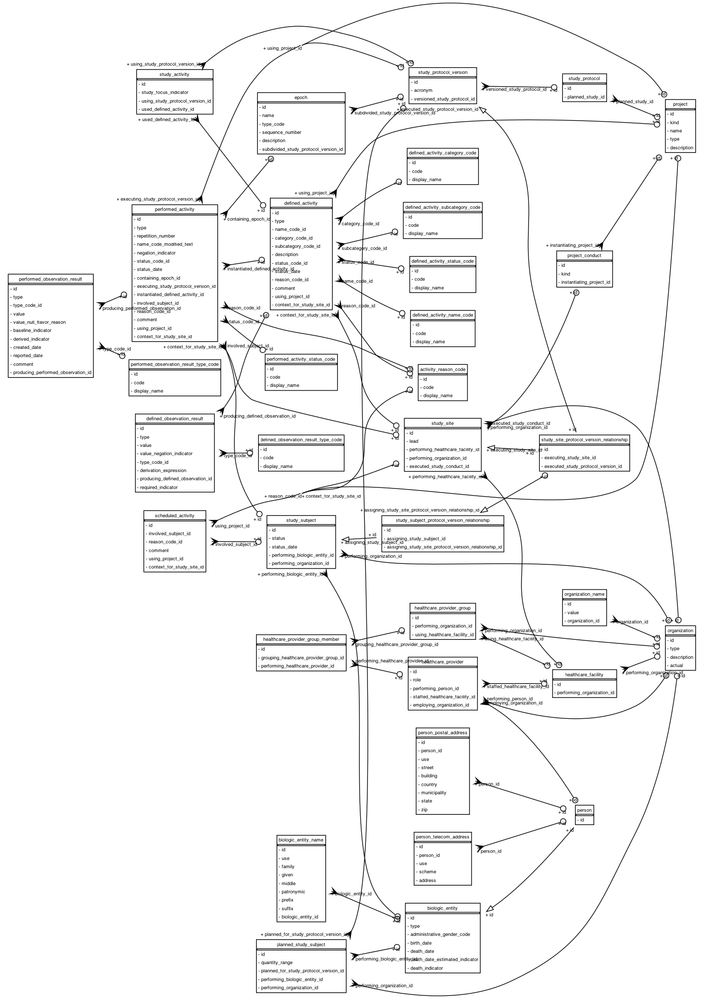
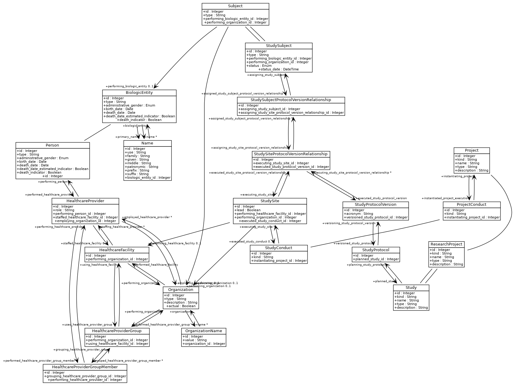

# Model

## Database diagram

## Class diagram

## Common

### BiologicEntity

::: umdb.common.BiologicEntity

## Person

### Person

::: umdb.person.Person

## Organization

### Organization

::: umdb.organization.Organization

### HealthcareFacility

::: umdb.organization.HealthcareFacility

### HealthcareProvider

::: umdb.organization.HealthcareProvider

### HealthcareProviderGroup

::: umdb.organization.HealthcareProviderGroup

### HealthcareProviderGroupMember

::: umdb.organization.HealthcareProviderGroupMember

## Study

### Project

::: umdb.study.Project

### ProjectConduct

::: umdb.study.ProjectConduct

### ResearchProject

::: umdb.study.ResearchProject

### Study

::: umdb.study.Study

### StudyConduct

::: umdb.study.StudyConduct

### StudySite

::: umdb.study.StudySite

### StudyProtocol

::: umdb.study.StudyProtocol

### StudyProtocolVersion

::: umdb.study.StudyProtocolVersion

### StudySiteProtocolVersionRelationship

::: umdb.study.StudySiteProtocolVersionRelationship

### Subject

::: umdb.study.Subject

### StudySubject

::: umdb.study.StudySubject

### StudySubjectProtocolVersionRelationship

::: umdb.study.StudySubjectProtocolVersionRelationship
