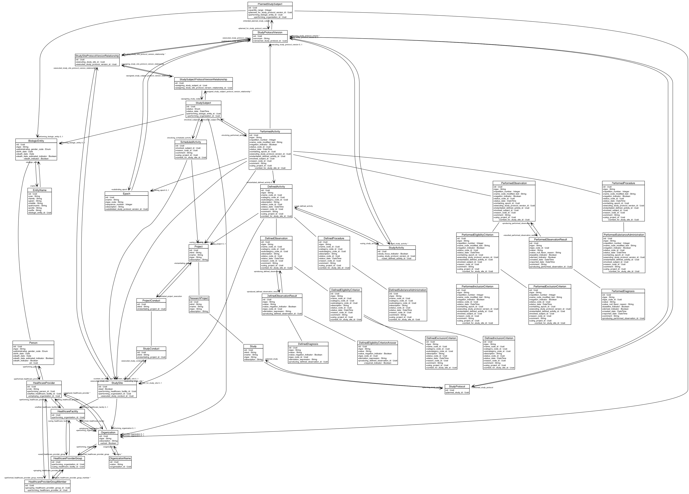

# Model

## Database diagram

## Class diagram

## Common

### BiologicEntity

::: bridg.common.BiologicEntity

### Person

::: bridg.common.Person

### Organization

::: bridg.common.Organization

### HealthcareFacility

::: bridg.common.HealthcareFacility

### HealthcareProvider

::: bridg.common.HealthcareProvider

### HealthcareProviderGroup

::: bridg.common.HealthcareProviderGroup

### HealthcareProviderGroupMember

::: bridg.common.HealthcareProviderGroupMember

### Project

::: bridg.common.Project

### ResearchProject

::: bridg.common.ResearchProject

### Study

::: bridg.common.Study

### Subject

::: bridg.common.Subject

## Protocol

### StudyProtocol

::: bridg.protocol.StudyProtocol

## Study

### ProjectConduct

::: bridg.study.ProjectConduct

### StudyConduct

::: bridg.study.StudyConduct

### StudySite

::: bridg.study.StudySite

### StudyProtocolVersion

::: bridg.study.StudyProtocolVersion

### StudySiteProtocolVersionRelationship

::: bridg.study.StudySiteProtocolVersionRelationship

### StudySubject

::: bridg.study.StudySubject

### StudySubjectProtocolVersionRelationship

::: bridg.study.StudySubjectProtocolVersionRelationship
